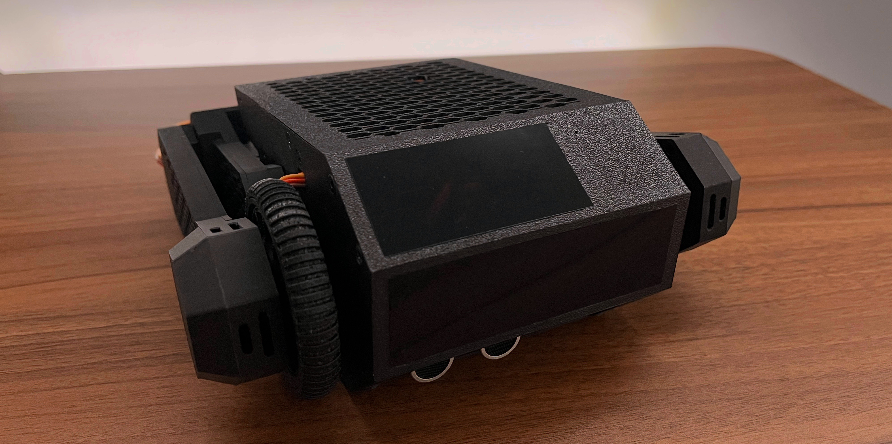

<i>Assembled Prototype v0.1.0</i>

<h1 style="text-align:center;">CYPHER</h1>

**CYPHER** is an open-source, autonomous two-wheeled bipedal AI robot. Being a wheeled-legged robot, powered by a Raspberry Pi 5 and equipped with a camera and distance sensor, Cypher can navigate around obstacles and maintain balance on uneven surfaces, but most notably, through OpenAI's Realtime API and inspired by the personality of Tars (Interstellar), Cypher can talk, ask questions, and act on commands (with its own unique personality and humour).

## Project Status & Next Steps

The robot has been fully designed, printed and assembled. All hardware required for self-balancing and movement including servos, wheel BLDC motors and encoders, buck converters, and ultrasonic distance sensor have been installed and connected to the PCB so the next stage is to begin coding leg-movement and self-balancing firmware on the ESP32.

Some modifications had to be made to the PCB. These included soldering wires to the underside corresponding to pins 5, 15, 21, and 22 of the ESP32 to allow for I2C communication with the AS5600 magnetic encoders - originally PCB routed to PWM input pins which unfortunately proved unreliable. In addition 2.2k pull-up resisters were soldered to pins 5 and 15 to stabilise the I2C line. In v1 the PCB files ([hardware/pcb/](hardware/pcb/)) will be re-routed according to any modification.

The current design (available inside [hardware/cad](hardware/cad/)) includes approximately 45 3d-printed parts and over 130 screws to assemble. The BOM, full assembly instructions and documentation will be available with v1. 

## Hardware Overview
- **Battery:** 11.1V 3S 2200mAh LiPo
- **PCB:** 2 layer custom PCB for power distribution & signal routing
- **Compute:** ESP32 + Raspberry Pi 5
- **Sensors:** AS5600 magnetic encoders, INA226 voltage sensor, MPU6050 IMU, INMP441 microphone, HCSR04 ultrasonic distance sensor
- **BLDC Driver:** SimpleFOCMini driver
- **Actuators:** MG996R + 20kg servos, 2208 80T brushless gimbal motors
- **Buck-Converters:** XL4016, 60W DFRobot Adjustable Buck Module
